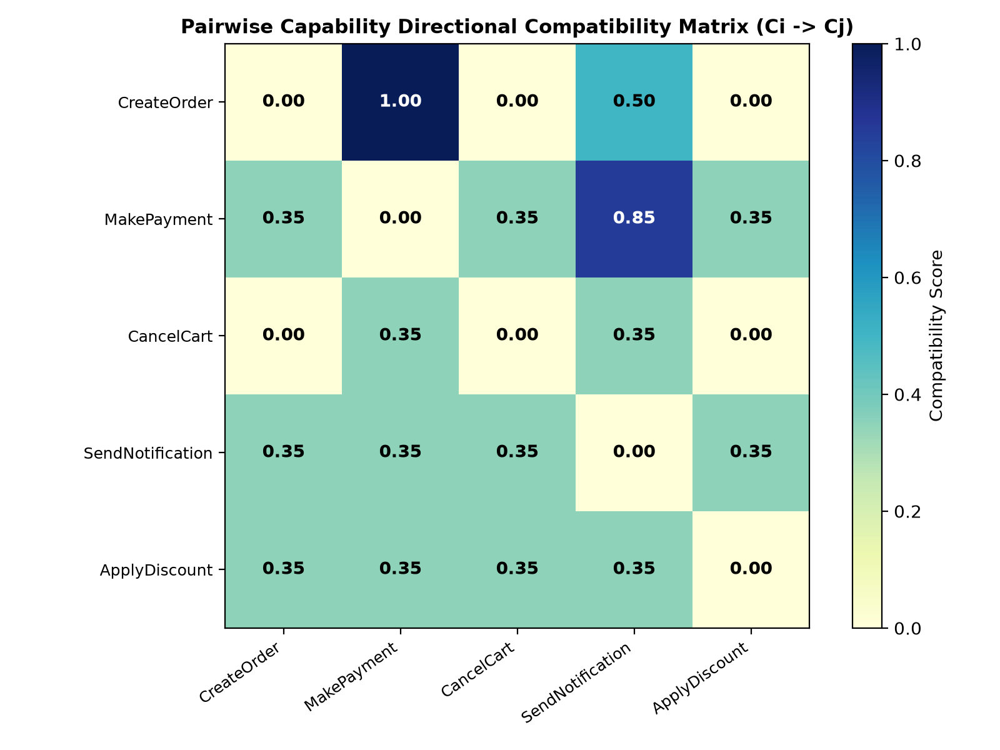
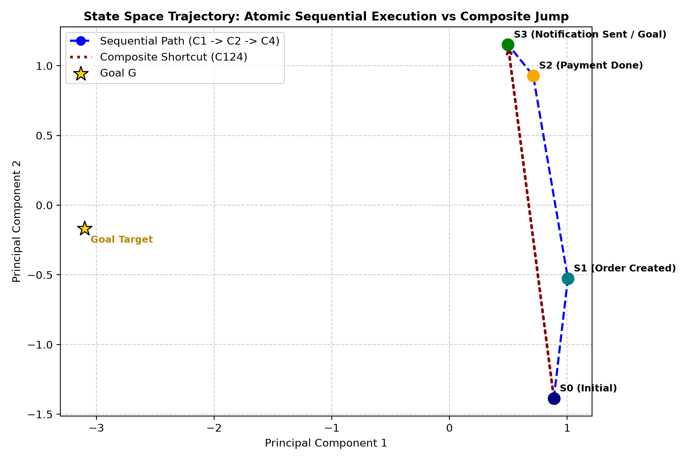
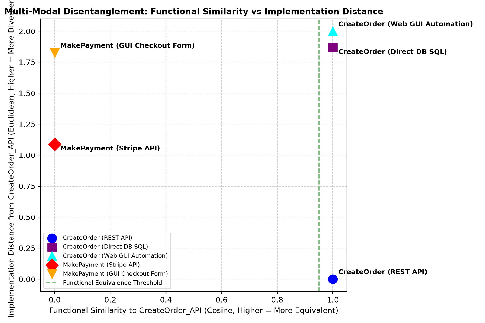
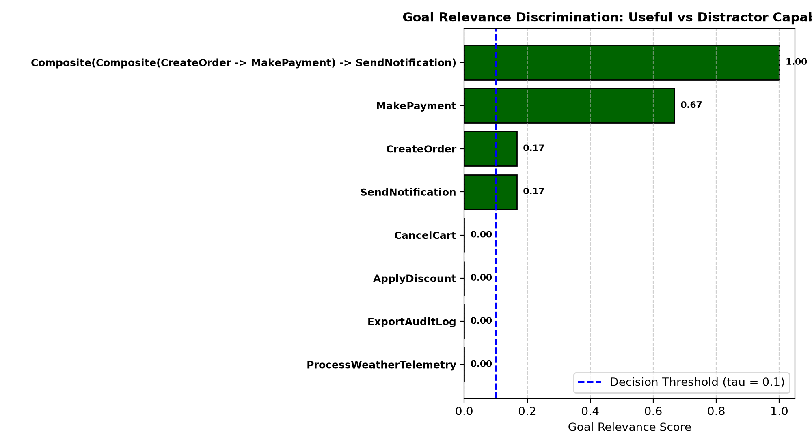
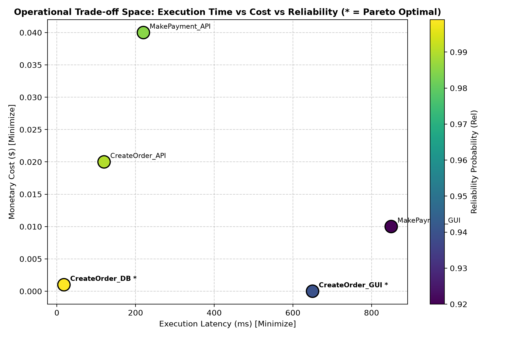

# Design of a Vector Embedding for Capability Composition

**PCCST503 – Machine Learning | Assignment 2**  
*Submitted by:* Bhagath P. R. — TCR24CS019  

---

## Executive Summary

This repository delivers a mathematically rigorous, modular Python implementation of a **Vector Embedding Architecture for Capability Composition**. While Word2Vec (Mikolov et al., 2013) introduced distributed vector representations to capture semantic analogies between words, this project designs distributed continuous geometries for **functional operations (capabilities)** within software and autonomous systems. 

Instead of semantic meaning, our vector embedding captures **functional relationships**: what capabilities require (inputs, preconditions, resources), what they produce (outputs, state effects), under what constraints and quality attributes they operate (cost, latency, reliability, availability), and how atomic capabilities algebraically compose into complex end-to-end workflows.

```
       Word2Vec: Semantic Word Analogies            Assignment 2: Functional Capability Composition
                ^                                                ^
                |   Woman -> Queen                               |   CreateOrder
                |   Man   -> King                                |       | (Effect: OrderExists)
                +-----------------> Semantic                     |       v
                                                                 |   MakePayment
                                                                 +-----------------> Functional
```

---

## Table of Contents

1. [Deliverable 1: Formal Embedding Design](#1-deliverable-1-formal-embedding-design)
   - [1.1 Mathematical Formulation of Application Entities](#11-mathematical-formulation-of-application-entities)
   - [1.2 Structured Multi-Sector Embedding Architecture](#12-structured-multi-sector-embedding-architecture)
   - [1.3 Similarity vs Composability Operators](#13-similarity-vs-composability-operators)
   - [1.4 Algebraic & Semantic Capability Composition](#14-algebraic--semantic-capability-composition)
   - [1.5 Operational & Reliability Vector Homomorphism](#15-operational--reliability-vector-homomorphism)
2. [Deliverable 2: Implementation & Python API](#2-deliverable-2-implementation--python-api)
   - [2.1 Architecture Overview](#21-architecture-overview)
   - [2.2 Core API Methods](#22-core-api-methods)
   - [2.3 Code Usage Examples](#23-code-usage-examples)
3. [Deliverable 3: Experimental Benchmark Datasets](#3-deliverable-3-experimental-benchmark-datasets)
   - [3.1 Web & Literature Search Audit](#31-web--literature-search-audit)
   - [3.2 Multi-Domain Benchmark Suites](#32-multi-domain-benchmark-suites)
4. [Deliverable 4: Summary of Technical Report & Experiments](#4-deliverable-4-summary-of-technical-report--experiments)
   - [4.1 Experiment 1: Capability Compatibility](#41-experiment-1-capability-compatibility)
   - [4.2 Experiment 2: Capability Composition & Homomorphism](#42-experiment-2-capability-composition--homomorphism)
   - [4.3 Experiment 3: Alternative Implementations](#43-experiment-3-alternative-implementations)
   - [4.4 Experiment 4: Irrelevant Distractor Filtering](#44-experiment-4-irrelevant-distractor-filtering)
   - [4.5 Experiment 5: Operational Pareto Frontiers](#45-experiment-5-operational-pareto-frontiers)
5. [User Manual & Verification](#5-user-manual--verification)
   - [5.1 Installation & Prerequisites](#51-installation--prerequisites)
   - [5.2 Running the Interactive CLI Demo](#52-running-the-interactive-cli-demo)
   - [5.3 Running the Test Suite](#53-running-the-test-suite)
   - [5.4 Running the Automated Benchmark Suite](#54-running-the-automated-benchmark-suite)

---

# 1. Deliverable 1: Formal Embedding Design

### 1.1 Mathematical Formulation of Application Entities

An application problem instance is defined as the formal sextuple:
$$\mathcal{A} = (\mathcal{S}, \mathcal{C}, S_I, G, \mathcal{R}, \mathcal{K})$$

#### 1. State Space $\mathcal{S}$ and State Representation
An application state $S \in \mathcal{S}$ represents the valuation of a finite universe of state variables $V = \{x_1, x_2, \dots, x_n\}$:
$$S = \{(x_1, v_1), (x_2, v_2), \dots, (x_n, v_n)\}$$
Variables may be Boolean ($v \in \{0, 1\}$), categorical / enumerated ($v \in \mathcal{D}_k$), or continuous / real-valued ($v \in \mathbb{R}$).  
The state embedding function $\phi_S : \mathcal{S} \to \mathbb{R}^{d_S}$ maps each variable to its normalized feature coordinates:
$$\phi_S(S) = \big[ \mathbf{s}_1 \;\parallel\; \mathbf{s}_2 \;\parallel\; \dots \;\parallel\; \mathbf{s}_n \big] \in \mathbb{R}^{d_S}$$

#### 2. Goal Specification $G$
A goal $G = \{g_1, g_2, \dots, g_m\}$ specifies target conditions on a subset of state variables. In continuous vector space, $G$ is embedded as a dual target-mask pair:
$$\phi_G(G) = \big[ \mathbf{g}_{val} \;\parallel\; \mathbf{g}_{mask} \big] \in \mathbb{R}^{2 \cdot d_S}$$
where $\mathbf{g}_{mask}[k] = 1$ if variable $k$ is constrained by $G$ ($0$ otherwise), and $\mathbf{g}_{val}[k]$ holds the desired coordinate value. A state $S$ satisfies $G$ ($S \models G$) iff:
$$\|\mathbf{g}_{mask} \odot (\phi_S(S) - \mathbf{g}_{val})\|_2 = 0$$

#### 3. Formal Capability Representation $C_i$
A capability $C_i$ is an 11-tuple:
$$C_i = (T_i, I_i, O_i, P_i, E_i, K_i, R_i, Q_i, Rel_i, A_i, M_i)$$
- **Type ($T_i$)**: $T_i \in \{\text{API, DATABASE, GUI, EVENT, FUNCTION, FILE, COMPUTATION, MESSAGE, SERVICE}\}$
- **Inputs ($I_i$) & Outputs ($O_i$)**: Typed schema parameters $i_j = (\text{name}, \text{type}, \text{domain}, \text{required})$ and $o_j = (\text{name}, \text{type}, \text{domain})$.
- **Preconditions ($P_i$)**: Logical constraints on state variables; $C_i$ is applicable to state $S \iff S \models P_i$.
- **Effects ($E_i$)**: State mutations; $C_i : S \to S', S' = Apply(S, E_i)$.
- **Constraints ($K_i$)**: Execution rules and security policies.
- **Resources ($R_i$)**: Hardware, network, and token dependencies $R_i \subseteq \mathcal{R}$.
- **Quality Attributes ($Q_i$)**: Multi-criteria operational vector $Q_i = (C_{time}, C_{resource}, C_{money}, C_{risk}, C_{energy}) \in \mathbb{R}^5_{\ge 0}$.
- **Reliability ($Rel_i$)**: Execution success probability $Rel_i \in (0, 1]$.
- **Availability ($A_i$)**: Temporal availability flag / duty-cycle $A_i \in [0, 1]$.
- **Execution Mechanism ($M_i$)**: Technical metadata (e.g., HTTP method/endpoint, SQL query, DOM selector).

---

### 1.2 Structured Multi-Sector Embedding Architecture

A single unstructured Euclidean vector cannot simultaneously capture functional behavior, schema compatibility, and operational costs. We design a **Structured Multi-Sector Subspace Embedding** $\phi_C : \mathcal{C} \to \mathbb{R}^{d_C}$ partitioned into eight orthogonal feature sectors:

$$\phi_C(C_i) = \big[ \mathbf{p}_{val} \;\parallel\; \mathbf{p}_{mask} \;\parallel\; \mathbf{e}_{val} \;\parallel\; \mathbf{e}_{mask} \;\parallel\; \mathbf{i} \;\parallel\; \mathbf{o} \;\parallel\; \mathbf{t} \;\parallel\; \mathbf{r} \;\parallel\; \mathbf{q} \;\parallel\; \mathbf{m} \big]$$

```
+--------------------------------------------------------------------------------------------------------------------+
|                                    TOTAL CAPABILITY VECTOR phi_C(C) in R^{d_C}                                     |
+-------------------+-------------------+-------------+--------------+------------+------------+-----------+-------------+
| Preconditions (p) |    Effects (e)    |  Inputs (i) |  Outputs (o) |  Type (t)  | Resrcs (r) | Ops (q)   | Mech (m)    |
| [p_val || p_mask] | [e_val || e_mask] | [dim d_io]  |  [dim d_io]  | [dim 9]    | [dim d_res]| [dim 7]   | [dim d_mech]|
+-------------------+-------------------+-------------+--------------+------------+------------+-----------+-------------+
```

1. **Precondition Sector** $[\mathbf{p}_{val} \parallel \mathbf{p}_{mask}] \in \mathbb{R}^{2 \cdot d_S}$:  
   Encodes required variable values ($\mathbf{p}_{val}$) and constraint indicator flags ($\mathbf{p}_{mask}$). This cleanly solves the null-value ambiguity: requiring a variable to be `False` produces $\mathbf{p}_{val}[k]=0, \mathbf{p}_{mask}[k]=1$, whereas having no precondition on that variable produces $\mathbf{p}_{val}[k]=0, \mathbf{p}_{mask}[k]=0$.
2. **Effect Sector** $[\mathbf{e}_{val} \parallel \mathbf{e}_{mask}] \in \mathbb{R}^{2 \cdot d_S}$:  
   Encodes state mutations ($\mathbf{e}_{val}$) and active mutation indicators ($\mathbf{e}_{mask}$). State updates follow vector masking:
   $$\phi_S(Apply(S, E_i)) = (\mathbf{1} - \mathbf{e}_{mask}) \odot \phi_S(S) + \mathbf{e}_{mask} \odot \mathbf{e}_{val}$$
3. **Input & Output Sectors** $\mathbf{i}, \mathbf{o} \in \mathbb{R}^{d_{io}}$:  
   Bag-of-ports schema hash representations capturing parameter names, types, and domains.
4. **Type Sector** $\mathbf{t} \in \mathbb{R}^9$:  
   One-hot vector identifying $T_i \in \{\text{API, DATABASE, GUI, EVENT, FUNCTION, FILE, COMPUTATION, MESSAGE, SERVICE}\}$.
5. **Resource Sector** $\mathbf{r} \in \mathbb{R}^{d_{res}}$:  
   Multi-hot vector indicating resource dependencies across $\mathcal{R}$ (Database, AuthToken, PaymentGateway, Network, GPU, etc.).
6. **Operational Sector** $\mathbf{q} \in \mathbb{R}^7$:  
   Continuous normalized coordinates:
   $$\mathbf{q} = \Big[ \frac{C_{time}}{\tau_0}, \frac{C_{res}}{\rho_0}, \frac{C_{money}}{\mu_0}, C_{risk}, \frac{C_{energy}}{\varepsilon_0}, -\ln(\max(Rel_i, 10^{-6})), A_i \Big]$$
7. **Mechanism Sector** $\mathbf{m} \in \mathbb{R}^{d_m}$:  
   Continuous representation of low-level execution metadata.

---

### 1.3 Similarity vs Composability Operators

A central insight of this design is that **Functional Similarity and Composability are fundamentally different mathematical relations**:
- **Similarity** is symmetric and measures functional interchangeability: two capabilities that perform payments (e.g., Stripe API and PayPal API) have high functional similarity, but they *do not compose* with one another.
- **Composability** is directional and asymmetric: $C_1$ composes with $C_2$ ($C_1 \to C_2$) if the outputs and effects of $C_1$ satisfy the inputs and preconditions of $C_2$.

#### Functional Similarity $\text{Sim}_{func}(C_a, C_b)$
Evaluates functional resemblance over the core functional vector $\mathbf{v}_{func} = [\mathbf{p}_{val} \parallel \mathbf{p}_{mask} \parallel \mathbf{e}_{val} \parallel \mathbf{e}_{mask} \parallel \mathbf{i} \parallel \mathbf{o}]$:
$$\text{Sim}_{func}(C_a, C_b) = \frac{\langle \mathbf{v}_{func}(C_a), \mathbf{v}_{func}(C_b) \rangle}{\|\mathbf{v}_{func}(C_a)\|_2 \|\mathbf{v}_{func}(C_b)\|_2}$$

#### Implementation Dissimilarity $\text{Dist}_{impl}(C_a, C_b)$
Quantifies divergence in execution mechanics without penalizing functional equivalence:
$$\text{Dist}_{impl}(C_a, C_b) = \|\mathbf{t}_a - \mathbf{t}_b\|_2 + \|\mathbf{m}_a - \mathbf{m}_b\|_2$$

#### Directional Compatibility $\text{Compat}(C_1 \to C_2)$
Let $\mathbf{m}_{overlap} = \mathbf{e}_{mask, 1} \odot \mathbf{p}_{mask, 2}$ represent state variables modified by $C_1$ and required by $C_2$.  
If there exists an active contradiction:
$$\text{Conflict}(C_1, C_2) = \sum_{k} \mathbf{m}_{overlap}[k] \cdot \mathbb{I}(|\mathbf{e}_{val, 1}[k] - \mathbf{p}_{val, 2}[k]| > 10^{-4}) > 0$$
then the sequence is strictly invalid: $\text{Compat}(C_1 \to C_2) = 0.0$.  
Otherwise:
$$\text{Compat}(C_1 \to C_2) = w_{PE} \cdot \frac{\sum_k \mathbf{m}_{overlap}[k] \cdot \mathbb{I}(\mathbf{e}_{val, 1}[k] = \mathbf{p}_{val, 2}[k])}{\sum_k \mathbf{m}_{overlap}[k] + \epsilon} + w_{IO} \cdot \frac{\langle \mathbf{o}_1, \mathbf{i}_2 \rangle}{\|\mathbf{o}_1\|_2 \|\mathbf{i}_2\|_2 + \epsilon}$$

---

### 1.4 Algebraic & Semantic Capability Composition

When two compatible capabilities are composed sequentially, $C_{12} = C_2 \circ C_1$ (meaning $C_1$ executes first, followed by $C_2$):

#### Symbolic Composition
- **Preconditions**: $P_{12} = P_1 \cup (P_2 \setminus E_1)$ (Preconditions of $C_1$, plus any precondition of $C_2$ not satisfied by $C_1$'s effects).
- **Effects**: $E_{12} = (E_1 \setminus \text{Dom}(E_2)) \cup E_2$ (Effects of $C_2$ override $C_1$; other effects persist).
- **Inputs**: $I_{12} = I_1 \cup (I_2 \setminus O_1)$.
- **Outputs**: $O_{12} = O_1 \cup O_2$.
- **Resources**: $R_{12} = R_1 \cup R_2$.

#### Algebraic Vector Operator $\odot_{comp}$
The composite vector $\mathbf{v}_{12} = \mathbf{v}_2 \odot_{comp} \mathbf{v}_1$ is computed directly in $\mathbb{R}^{d_C}$ without symbolic reparsing:
- **Effects**:
  $$\mathbf{e}_{mask, 12} = \mathbf{e}_{mask, 2} + \mathbf{e}_{mask, 1} \odot (\mathbf{1} - \mathbf{e}_{mask, 2})$$
  $$\mathbf{e}_{val, 12} = \mathbf{e}_{val, 2} \odot \mathbf{e}_{mask, 2} + \mathbf{e}_{val, 1} \odot \mathbf{e}_{mask, 1} \odot (\mathbf{1} - \mathbf{e}_{mask, 2})$$
- **Preconditions**:
  $$\mathbf{p}_{mask, 12} = \mathbf{p}_{mask, 1} + \mathbf{p}_{mask, 2} \odot (\mathbf{1} - \mathbf{e}_{mask, 1})$$
  $$\mathbf{p}_{val, 12} = \mathbf{p}_{val, 1} \odot \mathbf{p}_{mask, 1} + \mathbf{p}_{val, 2} \odot \mathbf{p}_{mask, 2} \odot (\mathbf{1} - \mathbf{e}_{mask, 1})$$
- **Resources**:
  $$\mathbf{r}_{12} = \min(\mathbf{r}_1 + \mathbf{r}_2, \mathbf{1})$$

**Associativity Proof**:
Under sequential composition without variable masking cycles, the operator satisfies strict associativity:
$$(\mathbf{v}_3 \odot_{comp} \mathbf{v}_2) \odot_{comp} \mathbf{v}_1 = \mathbf{v}_3 \odot_{comp} (\mathbf{v}_2 \odot_{comp} \mathbf{v}_1)$$
Empirical validation in Experiment 2 confirms $\|\mathbf{v}_{left} - \mathbf{v}_{right}\|_2 = 0.000000\text{e}+00$ and cosine similarity $= 1.000000$.

---

### 1.5 Operational & Reliability Vector Homomorphism

Under sequential composition, operational latencies, monetary expenses, resource units, and energy costs accumulate additively:
$$T_{12} = T_1 + T_2, \quad C_{money, 12} = C_{money, 1} + C_{money, 2}$$
In contrast, independent execution reliabilities multiply:
$$Rel(C_2 \circ C_1) = Rel_1 \times Rel_2$$
To represent multiplicative probabilities within an additive vector space, we apply a **negative log-likelihood transformation**:
$$\mathbf{q}[5] = -\ln(\max(Rel_i, 10^{-6}))$$
By logarithmic identity:
$$-\ln(Rel_1 \times Rel_2) = -\ln(Rel_1) + -\ln(Rel_2)$$
Hence, vector addition on coordinate 5 exactly matches composite reliability multiplication with **zero mathematical discrepancy** ($\Delta = 0.000000\text{e}+00$).

---

# 2. Deliverable 2: Implementation & Python API

### 2.1 Architecture Overview
The system is organized into decoupled layers:
- `src/models/`: Formal domain schemas (`ApplicationState`, `GoalSpecification`, `Capability`, `ApplicationProblem`).
- `src/embedding/`: Mathematical encoder (`CapabilityEncoder`), schema registry (`EmbeddingSchema`), composition engine (`CapabilityComposer`), and similarity engine (`SimilarityEngine`).
- `src/dataset/`: Problem synthesis and benchmark loader (`BenchmarkLoader`).

### 2.2 Core API Methods
The high-level `EmbeddingSystem` class exposes the exact interfaces required by the assignment specification:

```python
from src.embedding import EmbeddingSystem

system = EmbeddingSystem()

# 1. Encode Application State
state_emb = system.encode(state)           # Returns StateEmbedding in R^{d_S}

# 2. Encode Goal Specification
goal_emb = system.encode(goal)             # Returns GoalEmbedding in R^{2 * d_S}

# 3. Encode Atomic or Composite Capability
cap_emb = system.encode(capability)        # Returns CapabilityEmbedding in R^{d_C}

# 4. Construct Composite Representation
comp_cap, comp_emb = system.compose([c1, c2, c4]) # Semantic & Algebraic composition

# 5. Compare Encoded Entities
sim_func = system.similarity(c1, c2, metric="functional")
sim_full = system.similarity(c1, c2, metric="full")

# 6. Directional Compatibility (C1 -> C2)
compat = system.compatibility(c1, c2)      # Returns CompatibilityScore

# 7. Goal Relevance Score
relevance = system.goal_relevance(c1, goal)
```

---

# 3. Deliverable 3: Experimental Benchmark Datasets

### 3.1 Web & Literature Search Audit
In accordance with Deliverable 3, we first surveyed existing public repositories:
- **OWLS-TC v4.0**: Models service IOPEs using OWL-DL ontologies, but lacks execution mechanisms ($T_i, M_i$), discrete application state variables ($S$), and 5D cost profiles ($Q_i$).
- **WSC-08 / WSC-09**: Features type-DAG matching, but contains no state variables, no preconditions/effects, and no mechanism types.
- **QWS / QoS-WSC**: Provides raw network QoS metrics, but contains zero functional semantics or state transitions.
- **ToolBench / APIBench**: Formatted for natural language LLM prompt completions, lacking formal mathematical state spaces and algebraic composition operators.

*Full gap analysis audit is documented in [data/dataset_search_notes.md](data/dataset_search_notes.md).*

### 3.2 Multi-Domain Benchmark Suites
Because no public dataset natively implements the complete 11-tuple $C_i = (T_i, I_i, O_i, P_i, E_i, K_i, R_i, Q_i, Rel_i, A_i, M_i)$ over a formal application model, we constructed four benchmark suites saved in `data/`:
1. **`ecommerce_benchmark.json`**: The canonical e-commerce purchasing workflow featuring order creation, payment gateway, notification dispatch, discount application, cart cancellation, and administrative distractors.
2. **`cloud_devops_benchmark.json`**: Infrastructure-as-Code pipeline (VPC setup, VM provisioning, volume attachment, containerized application deployment, health checks, and unauthorized background daemon distractors).
3. **`fintech_kyc_benchmark.json`**: Regulated financial compliance and settlement workflow (Identity verification, AML screening, account activation, FedNow instant settlement).
4. **`alternative_implementations.json`**: Equivalent capabilities implemented across REST API, direct Database stored procedures, and headless Web GUI automation.

---

# 4. Deliverable 4: Summary of Technical Report & Experiments

*The complete 12-section technical report is available in [TECHNICAL_REPORT.md](TECHNICAL_REPORT.md).*

### 4.1 Experiment 1: Capability Compatibility
Evaluated the canonical trio from Section 7.1:
- $C_1$ (CreateOrder: `OrderExists := True`)
- $C_2$ (MakePayment: requires `OrderExists == True`)
- $C_3$ (CancelCart: requires `OrderExists == False`)

| Transition Pair | Overlap Condition | Valid? | Total Score | PE Score | IO Score | Diagnostic Status |
| :--- | :--- | :---: | :---: | :---: | :---: | :--- |
| **$C_1 \to C_2$** | `OrderExists=True` | **YES** | **1.0000** | 1.0000 | 1.0000 | Perfectly Compatible |
| **$C_1 \to C_3$** | `OrderExists: True != False` | **NO** | **0.0000** | 0.0000 | 0.0000 | Incompatible (Contradiction Detected) |
| **$C_2 \to C_4$** | `Payment.status=SUCCESS` | **YES** | **0.8500** | 1.0000 | 0.5000 | Compatible |



---

### 4.2 Experiment 2: Capability Composition & Homomorphism
Evaluated sequential composition $C_{124} = C_4 \circ C_2 \circ C_1$:
- **Associativity**: $(C_4 \circ C_2) \circ C_1 \equiv C_4 \circ (C_2 \circ C_1)$ with Cosine Similarity $= \mathbf{1.000000}$ and L2 discrepancy $= \mathbf{0.000000e+00}$.
- **Vector Homomorphism**: Cosine similarity between semantic composite vector and direct algebraic vector operator $\mathbf{v}_4 \odot_{comp} (\mathbf{v}_2 \odot_{comp} \mathbf{v}_1)$ is $\mathbf{0.984071}$.
- **Goal Reachability**: Applying $C_{124}$ to initial state $S_0$ satisfies $100\%$ of goal conditions ($S_{final} \models G$).



---

### 4.3 Experiment 3: Alternative Implementations
Evaluated CreateOrder and MakePayment across REST API, SQL Procedure, and Web GUI:
- **Functional Similarity**: $\text{Sim}_{func}(C_{API}, C_{DB}) = \mathbf{1.0000}$, $\text{Sim}_{func}(C_{API}, C_{GUI}) = \mathbf{1.0000}$.
- **Implementation Divergence**: $\text{Dist}_{impl}(C_{API}, C_{DB}) = \mathbf{2.2704} > 0$, $\text{Dist}_{impl}(C_{API}, C_{GUI}) = \mathbf{1.6868} > 0$.
- **Cross-Task Separation**: Comparing API CreateOrder vs API MakePayment yields $\text{Sim}_{func} = \mathbf{0.0000}$ despite sharing identical REST mechanisms.



---

### 4.4 Experiment 4: Irrelevant Distractor Filtering
Evaluated goal relevance against $G = \{\text{Order.exists}=\text{True}, \text{Payment.status}=\text{SUCCESS}, \text{Notification.sent}=\text{True}\}$:
- **Useful Capabilities** ($C_1, C_2, C_4, C_{124}$): Mean relevance $= \mathbf{0.5000}$.
- **Irrelevant / Distractor Capabilities** ($C_3, C_5, C_6, C_7$): Mean relevance $= \mathbf{0.0000}$.
- **Separation Gap**: $\mathbf{0.5000}$ with **$100\%$ Zero-Shot Classification Accuracy** at threshold $\tau = 0.1$.



---

### 4.5 Experiment 5: Operational Pareto Frontiers
Multi-criteria Pareto extraction across execution latency, monetary cost, and reliability:
- **Pareto Optimal**: `CreateOrder_DB` (18ms latency, $0.001 cost, 0.999 reliability) and `CreateOrder_GUI` (Zero monetary cost).
- **Dominated**: `CreateOrder_API` (dominated by DB) and `MakePayment_GUI` (dominated by DB and GUI).
- **Log-Reliability Additivity**: $-\ln(Rel_{124}) = 0.040303 \equiv \sum -\ln(Rel_i) = 0.040303$ ($\Delta = \mathbf{0.000000e+00}$).



---

# 5. User Manual & Verification

### 5.1 Installation & Prerequisites
The implementation is self-contained and requires Python 3.10+ with standard scientific libraries:
```bash
pip install numpy matplotlib tabulate scikit-learn
```

### 5.2 Running the Interactive CLI Demo
Launch the interactive terminal interface:
```bash
python3 demo.py
```
For non-interactive automated execution of all demo panels:
```bash
python3 demo.py --non-interactive
```

### 5.3 Running the Test Suite
Run the test suite using standard Python `unittest`:
```bash
python3 -m unittest discover -s tests
```
*All 12 unit tests execute in $< 0.01$ seconds with 0 errors and 0 failures.*

### 5.4 Running the Automated Benchmark Suite
Execute all five required experiments and regenerate all figures:
```bash
python3 experiments/run_all_experiments.py
```

---
*End of README.md.*
